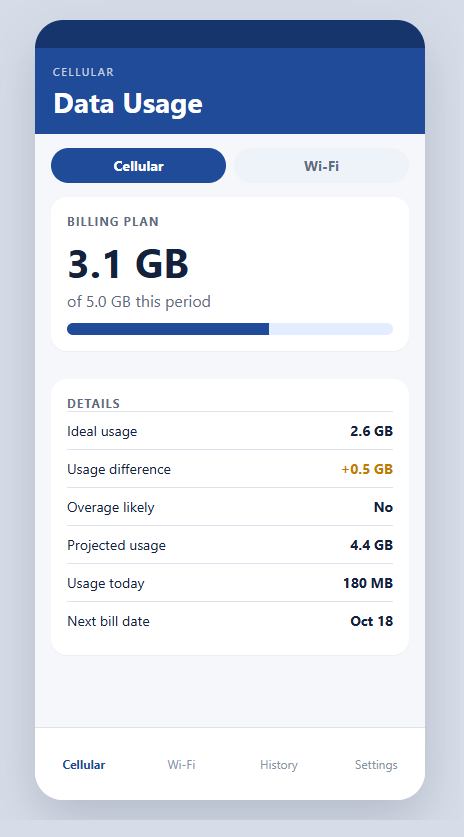
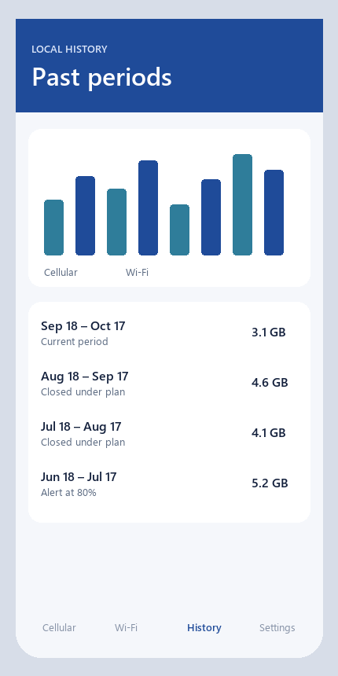

# Data Usage for Android

Data Usage is an Android app for monitoring cellular and Wi-Fi consumption, configuring data plans and alerts, reviewing usage history, and exposing current totals through home-screen widgets. The app stores usage snapshots locally and refreshes them in the background with WorkManager.

## Screens

The cellular plan and history views. The gigabyte figures below are sample data placed on the app's screen structure so the layout is visible without an emulator.





This public showcase contains the runnable application, its domain/data layers, widgets, focused JVM tests, and the current CI validation workflow. It uses Google’s official test AdMob identifiers by default; publishing credentials are never stored in the repository.

## What this demonstrates

- Modernized Android build tooling with Java 17, Gradle 9.7.1, Android SDK 37, and the AndroidX/WorkManager stack.
- A legacy codebase brought forward without changing the core product workflow: cellular and Wi-Fi plans, alerts, history, settings, and widgets.
- A local-first persistence model using SQLite/ORMLite, with background refresh coordinated by WorkManager.
- Explicit validation through debug assembly, JVM unit tests, lint, and a GitHub Actions workflow.

## Requirements

- Android Studio with its bundled JDK 17, or another JDK 17 installation
- Android SDK Platform 37 and Build Tools 36.0.0
- An Android emulator or device running API 34 or newer for smoke testing

The repository includes the Gradle wrapper, so no separate Gradle installation is required.

## Build and test

```sh
./gradlew assembleDebug
./gradlew testDebugUnitTest
./gradlew lintDebug
./gradlew assembleRelease
```

For a clean verification run:

```sh
./gradlew clean check
```

The release APK is unsigned unless a future signing configuration is supplied.

## Run on an emulator

Build and install the debug APK, then launch the main activity:

```sh
./gradlew assembleDebug
adb install -r app/build/outputs/apk/debug/app-debug.apk
adb shell am force-stop com.sigterm
adb shell am start -W -n com.sigterm/.activities.DataUsageActivity
```

The Android Studio emulator smoke test and subsystem coverage are documented in [docs/TESTING.md](docs/TESTING.md).

## Configuration

Local builds use Google test AdMob identifiers by default. For release or publishing builds, set:

- `ADMOB_APP_ID`
- `ADMOB_BANNER_AD_UNIT_ID`

These values are injected at build time and should not be committed.

## Repository guide

- [AGENTS.md](AGENTS.md) — compact operating guide for coding agents
- [docs/CONTEXT_INDEX.md](docs/CONTEXT_INDEX.md) — choose the minimum task-relevant documentation
- [docs/ARCHITECTURE.md](docs/ARCHITECTURE.md) — modules, data flow, and entry points
- [docs/PRODUCT_BEHAVIOR.md](docs/PRODUCT_BEHAVIOR.md) — user-visible workflows and edge cases
- [docs/INVARIANTS.md](docs/INVARIANTS.md) — rules that must remain true
- [docs/DECISIONS.md](docs/DECISIONS.md) — active architectural/product decisions

The application module is under `app/`; Java sources are under `app/src/main/java/com/sigterm/`, resources under `app/src/main/res/`, and JVM tests under `app/src/test/`.
