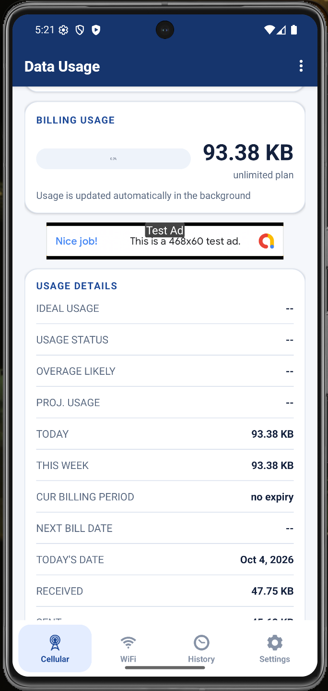
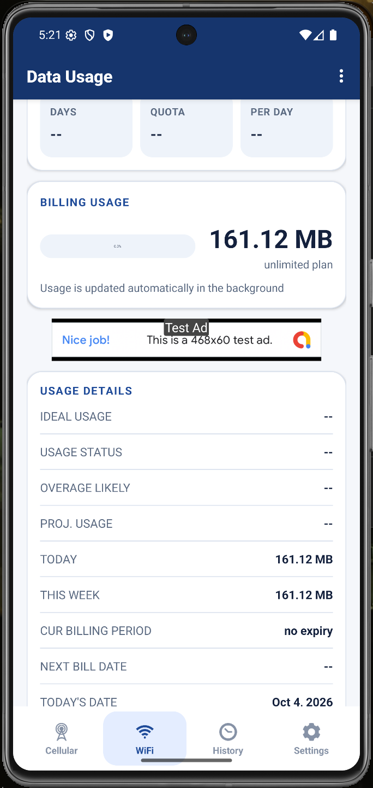
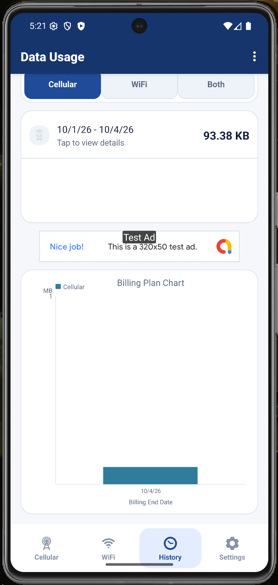

# Data Usage for Android

Data Usage is an Android app for monitoring cellular and Wi-Fi consumption, configuring data plans and alerts, reviewing usage history, and exposing current totals through home-screen widgets. The app stores usage snapshots locally and refreshes them in the background with WorkManager.

## Screenshots

These screenshots come from the current debug build running on an Android emulator and show the
cellular, Wi-Fi, and history workflows. The displayed usage values are local emulator data, not
benchmark results.

<table>
  <tr>
    <td></td>
    <td></td>
    <td></td>
  </tr>
  <tr>
    <th>Cellular</th>
    <th>Wi-Fi</th>
    <th>History</th>
  </tr>
</table>

This public repository is a demo showcase containing screenshots and a short product overview. The complete Android source code is maintained privately in [AaravPa/DataUsage-android-private](https://github.com/AaravPa/DataUsage-android-private).

## What the app demonstrates

- Modernized Android build tooling with Java 17, Gradle 9.7.1, Android SDK 37, and the AndroidX/WorkManager stack.
- A legacy codebase brought forward without changing the core product workflow: cellular and Wi-Fi plans, alerts, history, settings, and widgets.
- A local-first persistence model using SQLite/ORMLite, with background refresh coordinated by WorkManager.
